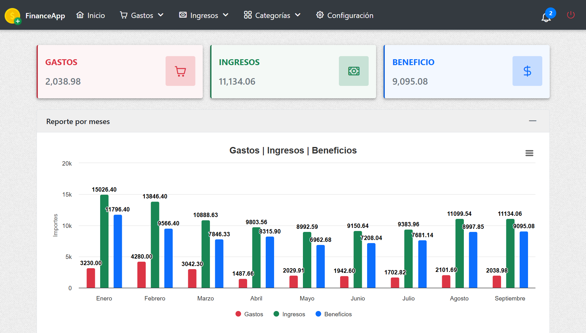
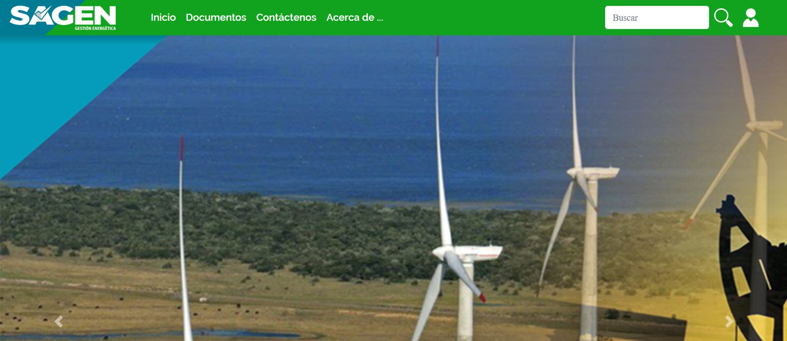
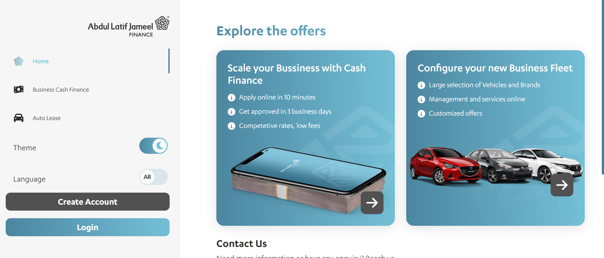

# 👨🏻‍💻 Fernando Hidalgo Rosabal

**`Ingeniero en Ciencias Informáticas | Desarrollador Web Full-Stack`**

¡Hola! Soy Fernando, un apasionado desarrollador de software nacido en Cuba y actualmente viviendo en Brasil. Me gradué como Ingeniero en Ciencias Informáticas y he dedicado mi carrera a la programación con mayor experiencia en el desarrollo de aplicaciones web.

---

### 🛠️ Lenguajes y Tecnologías

 

---

### ✨ Otras Tecnologías 

 

---

### 🖥️ **Proyectos**

 

---
