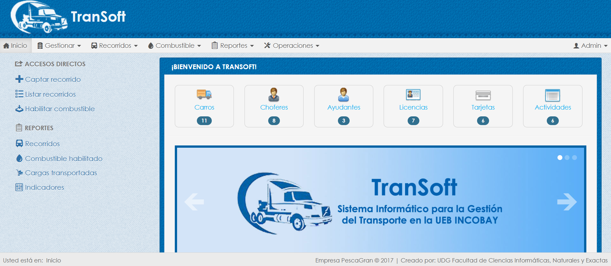
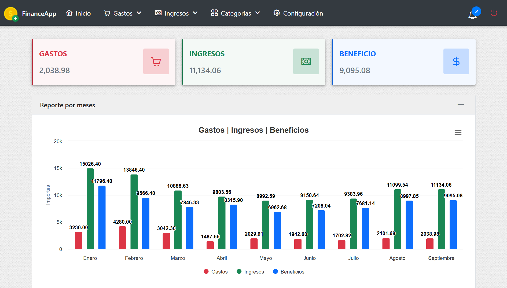
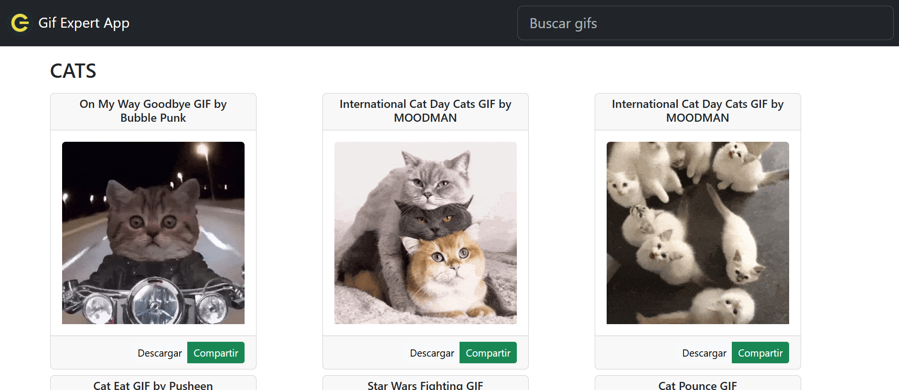
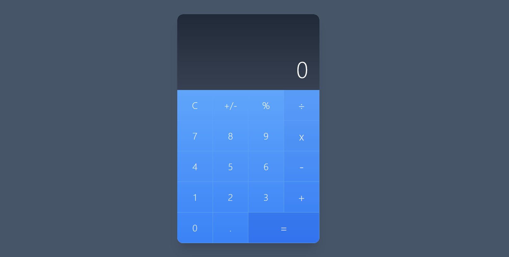

# 👨🏻‍💻 Fernando Hidalgo Rosabal

**`Ingeniero en Ciencias Informáticas | Desarrollador Web Full-Stack`**

¡Hola! Soy Fernando, un apasionado desarrollador de software nacido en Cuba y actualmente viviendo en Brasil. Me gradué como Ingeniero en Ciencias Informáticas y he dedicado mi carrera a la programación con mayor experiencia en el desarrollo de aplicaciones web.

---

### 🛠️ Lenguajes y Tecnologías

 

---

### ✨ Otras Tecnologías 

 

---

### 🖥️ **Proyectos**

<table>
  <tr>
    <td align="center">
       
      
<strong>TranSoft:</strong> Sistema desarrollado en CodeIgniter 3.0.6, Bootstrap v2.3.2 y jQuery 1.9.1 como parte del proyecto de tesis de la carrera de Ingeniería en Ciencias Informáticas. Está diseñado para gestionar la información relacionada con el transporte.

    </td>
    <td align="center">
       
      
<strong>FinanceApp:</strong> Aplicación web desarrollada en Angular 13.0.0 con NgPrime 13.1.0 (frontend) y Laravel 9.0.0 (backend). Es creada para la gestión financiera de manera eficiente, ya sea a nivel personal o para pequeñas empresas.

    </td>
  </tr>
  <tr>
    <td align="center">
       
      
<strong>SAGEN:</strong> Es una plataforma informática desarrollada en Laravel por la empresa Desoft, donde integré el equipo de desarrollo. Permite a las Organizaciones Superiores de Dirección Empresarial (OSDE), Uniones de Empresas y entidades, la gestión energética desde las estructuras de su subordinación.

    </td>
    <td align="center">
       
      
<strong>SNB Mobile:</strong> Aplicación de banca móvil desarrollada por Crealogix en Angular y Cordova para la integración multiplataforma, en la que participé como parte del equipo de desarrollo. Diseñada para el Banco Nacional Saudí (Saudi National Bank), permite a los clientes realizar transacciones bancarias digitales sin necesidad de visitar una sucursal.

    </td>
  </tr>
  <tr>
    <td align="center">
       
      
<strong>Jameel Business (Aljuf Finance):</strong> Aplicación bancaria desarrollada en Angular por Crealogix, donde participé como parte del equipo de desarrollo. Ofrece soluciones financieras avanzadas para pequeñas y medianas empresas. Como la solicitud de financiamiento digital y consulta de contratos de manera rápida y sencilla desde un teléfono o computadora.

    </td>
    <td align="center">
       
      
<strong>Tic tac toe:</strong> Aplicación desarrollada en React 18.3.1 como parte del curso "Aprendiendo React" de Midudev. Esta aplicación recrea el clásico juego del gato (tres en raya) con una interfaz sencilla pero ideal para practicar conceptos fundamentales de React.

    </td>
  </tr>  
  <tr>  
    <td align="center">
       
      
<strong>GifExpertApp</strong> Aplicación desarrollada en React 18.3.1 y Bootstrap 5.3.3 como parte del curso "React: De cero a experto (Hooks y MERN)" de Fernando Herrera. Esta aplicación permite buscar y mostrar GIFs animados utilizando la API de <a href="https://developers.giphy.com">Giphy</a>.

    </td>
    <td align="center">
       
      
<strong>Calculator</strong> Aplicación desarrollada en Angular 19.0.1 y Tailwind CSS como parte del curso "Angular Pro: Lleva tus bases al siguiente nivel" de Fernando Herrera. Es una implementación práctica que destaca las nuevas características de las nuevas versiones de Angular.

    </td>
  </tr>
</table>

---
